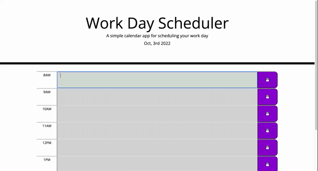

# Work_Day_Scheduler

## Description
This interactive list is a great way to track a daily todo list. Eeach feild is color coded to whether the current time is past, present, or furtur. The box will show gray if the time has passed, red if present or green if futur. The buttons to the right of the text box allows for the user to save their todo for that block of time. It saves the data locally so if the page is refreshed it will still show. 

## Examples

The following video snippet shows the usage of the scheduler.

## Use
This is a great way to track your work day and save your todo list and watch the colors to ensure you stay on task. 